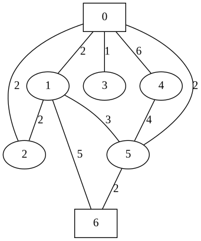

Suppose we have an undirected graph G representing m roads (edges) connecting n towns (nodes), with edge weights describing the distances along the road in miles.
Some of these towns have a bus station (call the number of towns with bus stations b).
Each town with a bus station has buses that travel from that town along the roads, and have a one-way range of d miles: every town within d miles of road travel from this town through any number of other towns is reachable.
A town is well-connected if it is reachable by bus from at least k towns (including itself, if it has a bus station) for some fixed number k.
Given G, the list of b towns with bus stations, d, and k, determine the number of well-connected towns.

All graphs will be given with nodes numbered from 0 to n-1, and edges will be provided in a list. For the above:

n - number of towns in the graph (integer)

m - number of roads in the graph (integer)

d - distance a bus can travel one-way (integer)

k - number of towns in order to consider well-connected (integer)

b - number of towns with bus stations (integer)

Where n > b >= k

You may assume that all edge weights are greater than 0. The graph may not be connected.



_In the above example nodes 0 and 6 are towns with bus stations._

---

# Linear Regression

Linear regression is a supervised learning algorithm that is used to predict a continuous variable. It is a linear approach to modeling the relationship between a dependent variable and one or more independent variables. The goal is to minimize the sum of the squared residuals. The sum of squared residuals is the sum of the squared differences between the actual y values and the predicted y values. The residuals are the differences between the actual y values and the predicted y values. The predicted y values are calculated using the equation of the line.

<div class="mb-2"></div>

```python
Time Complexity: O(b[(n + m)log(m)])

import heapq

def bfs_helper(starting_node: int, max_distance: int, adj_list: dict, connected_towns_count_map: dict):
    min_heap = [[0, starting_node]]
    visited = set()

    while min_heap:
        current_total_distance, current_node = heapq.heappop(min_heap)

        if current_node in visited:
            continue

        if current_total_distance > max_distance:
            break

        visited.add(current_node)

        connected_towns_count_map[current_node] += 1

        for dst_weight, dst in adj_list[current_node]:
            if dst not in visited:
                heapq.heappush(min_heap, [dst_weight + current_total_distance, dst])


def main():
    n = int(input())
    d = int(input())
    k = int(input())
    b = int(input())
    m = int(input())
    bus_station_nodes = [int(x) for x in input().split()]

    adj_list = {}
    connected_towns_count_map = {}

    for i in range(n):
        adj_list[i] = []
        connected_towns_count_map[i] = 0

    for _ in range(m):
        src, dst, weight = [int(x) for x in input().split()]
        adj_list[src].append([weight, dst])
        adj_list[dst].append([weight, src])

    for node in bus_station_nodes:
        bfs_helper(node, d,
              adj_list, connected_towns_count_map)

    n_well_connected_towns = 0

    for n_stations in connected_towns_count_map.values():
        if n_stations >= k:
            n_well_connected_towns += 1

    print("Number of well connected towns:", n_well_connected_towns)

main()
```

<div class="mb-2"></div>

### Test Case

```md
Input:

7
5
2
2
10
0 6
0 1 2
0 2 2
0 3 1
0 4 6
0 5 2
1 2 2
1 5 3
1 6 5
4 5 4
5 6 2

Expected output:

5
```
